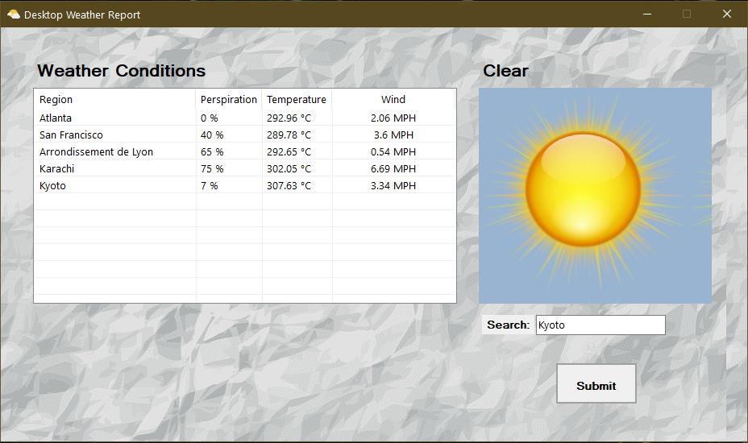

# DesktopWeatherReport

## Summary:

.NET 5 desktop application that utilizes OpenWeather API to receive weather data.

## Application Runtime Instructions:

1. Create a [OpenWeather](https://openweathermap.org/) account for yourself and use your API URL for the partial URL application 
variable and the secret key you generated from your account for the secret key application variable.
2. Set up your application variables using the properties tab on your project file in the "settings"
configuration, which will generate a Settings file for you.
